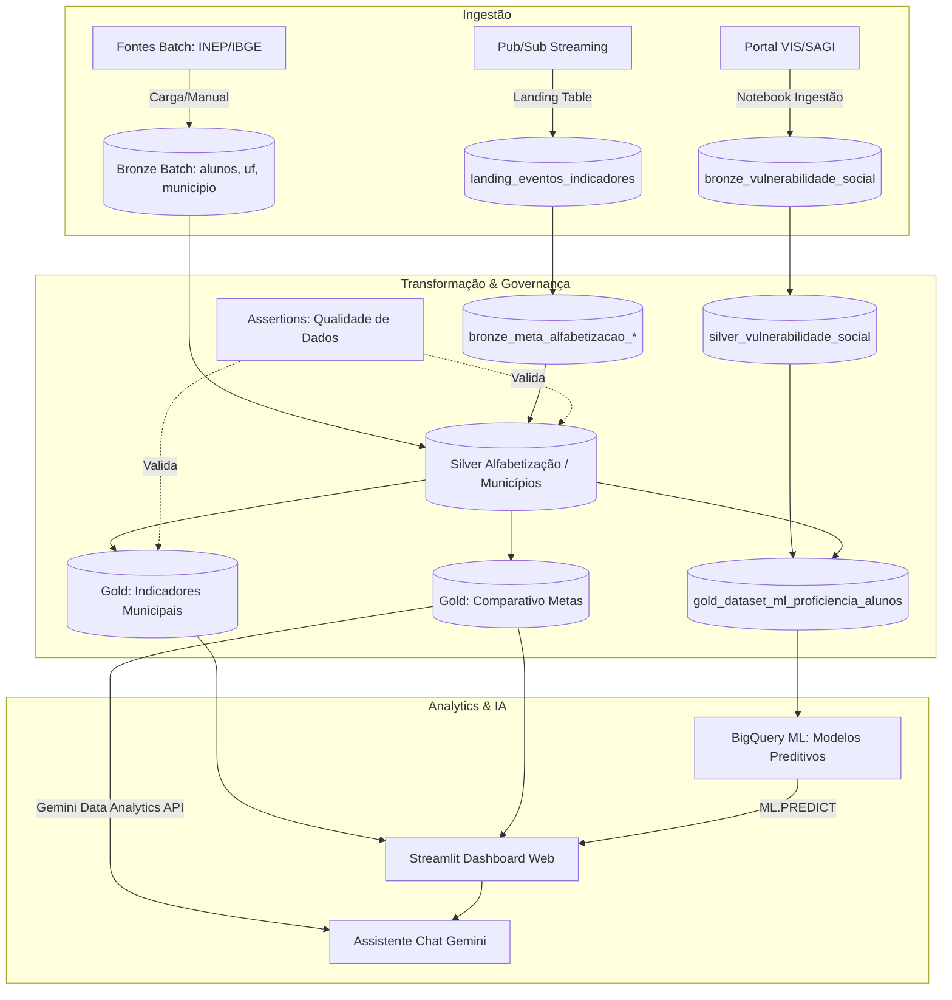

# 🎓 1IAST - Tech Challenge Fase 2: Pipeline de Engenharia, Governança e IA (Alfabetização & Vulnerabilidade)

Este repositório contém a solução completa para o **Tech Challenge Fase 2** (Grupo 1IAST), consistindo em um pipeline robusto de engenharia de dados, qualidade de dados (Governança), treinamento de modelos de Inteligência Artificial (BigQuery ML) e uma aplicação de visualização interativa (Streamlit) integrada ao ecossistema Google Cloud.

---

## 1. Contexto do Problema e Desafio Educacional

A alfabetização na infância é um dos pilares fundamentais para o desenvolvimento educacional, social e econômico de um país. Nesse contexto, o **Compromisso Nacional Criança Alfabetizada** surge como uma política pública que mobiliza União, estados, Distrito Federal e municípios com o objetivo de garantir que todas as crianças brasileiras estejam alfabetizadas até o final do **2º ano do ensino fundamental**.

Para apoiar a definição de parâmetros nacionais de alfabetização, o Instituto Nacional de Estudos e Pesquisas Educacionais Anísio Teixeira (INEP) realizou, em 2023, a **Pesquisa Alfabetiza Brasil**. A partir desse estudo, foi definido o ponto de corte de **743 pontos** na escala de proficiência do Saeb, nível a partir do qual uma criança pode ser considerada alfabetizada.

Com base nesse parâmetro, foi criado o **Indicador Criança Alfabetizada**, que expressa o percentual de estudantes que atingem esse patamar de proficiência. A meta nacional é que, até 2030, todas as crianças brasileiras estejam alfabetizadas ao final do 2º ano do ensino fundamental.

### O Desafio Tecnológico e de Gestão:
Tradicionalmente, os indicadores de alfabetização são **retrospectivos** — mostram o problema após o término do ano letivo, inviabilizando ações corretivas a tempo. O objetivo deste projeto é construir uma solução de dados moderna que permita:
1.  **Monitorar proativamente** o cumprimento das metas municipais, estaduais e nacionais vinculadas ao Indicador Criança Alfabetizada.
2.  **Prever o risco de defasagem** de proficiência de um aluno antes do término do ciclo, cruzando dados educacionais com indicadores socioeconômicos de vulnerabilidade do CadÚnico.
3.  Permitir aos gestores públicos simular cenários (através de modelos preditivos) e interagir com os dados de forma intuitiva.

---

## 2. Arquitetura Proposta e Fluxo de Dados

A solução adota uma abordagem de **Modern Data Stack** na nuvem do Google Cloud, utilizando o **Dataform** para orquestração ELT baseada na **Arquitetura Medalhão** (Bronze -> Silver -> Gold) com qualidade de dados certificada via **Assertions**.

### Diagrama do Pipeline e Fluxo de Dados:



### Descrição das Camadas:

*   **Camada Bronze**: Replicação fiel dos dados brutos das fontes (INEP, IBGE, CadÚnico/SAGI). A tabela de vulnerabilidade é ingerida via notebook Python agendado, e as metas podem ser recebidas via Pub/Sub incremental.
*   **Camada Prata**: Limpeza, padronização (remoção de espaços com `TRIM`, padronização com `INITCAP`, tratamento de nulos com `COALESCE`) e enriquecimento territorial (conversão de códigos de 6 para 7 dígitos do IBGE usando a tabela oficial de diretórios). Agregação anual para unificar granularidade de dados de vulnerabilidade.
*   **Camada Ouro**: Modelagem analítica focada no negócio. Agrega visões nacionais, estaduais e municipais (`gold_comparativo_metas_resultados`) prontas para BI, e prepara o dataset específico purificado para treinamento de modelos de IA (`gold_dataset_ml_proficiencia_alunos`).

---

## 3. Tecnologias Utilizadas & Justificativas

| Ferramenta | Função | Justificativa da Escolha |
| :--- | :--- | :--- |
| **Google BigQuery** | Data Warehouse / Storage | Escalabilidade massiva para petabytes de dados e motor de execução de SQL analítico rápido. |
| **Google Cloud Dataform** | Engenharia de Dados (ELT) | Gerenciamento de dependências nativo no BigQuery, versionamento Git, controle de ambiente e asserções de qualidade integradas. |
| **BigQuery ML (BQML)** | Inteligência Artificial (ML) | Permite treinar modelos preditivos (XGBoost/Regressão) diretamente no DW usando SQL, eliminando custos de movimentação de dados e infraestrutura externa. |
| **Cloud Composer (Airflow)**| Orquestração do Pipeline | Disparo automático e sequencial das tarefas de ingestão (Notebook) e materialização (Dataform). |
| **Streamlit** | Interface Web (Dashboard) | Desenvolvimento ágil em Python, com componentes nativos para gráficos interativos (Plotly) e formulários para simulação de IA. |
| **Gemini Data Analytics API**| IA Generativa (LLM) | Permite integração do chat assistente diretamente na base Ouro do BigQuery com separação de raciocínio (thoughts) e suporte multi-turno. |

---

## 4. Decisões Arquiteturais e Otimizações (Trade-Offs & Custos)

A arquitetura foi desenhada focando em **eficiência de performance** e **otimização de custos operacionais** (FinOps) no ambiente Google Cloud Platform (GCP), pesando os seguintes trade-offs:

### Batch vs. Streaming:
*   *Decisão*: **Híbrido**. Dados estruturados volumosos (INEP/IBGE) são atualizados anualmente, sendo ideais para processamento **Batch**. No entanto, a arquitetura está preparada para receber atualizações incrementais (Streaming) via Pub/Sub para a tabela de metas, permitindo atualizações dinâmicas no painel sem reprocessar o histórico.

### Data Lake vs. Data Warehouse:
*   *Decisão*: **Lakehouse (BigQuery)**. Em vez de manter arquivos brutos no GCS e processá-los externamente, os dados são persistidos diretamente no BigQuery. Isso elimina a latência de movimentação de dados e permite usar o poder de computação distribuída do BigQuery para transformações e ML.

### Custo vs. Performance (Otimizações FinOps):
*   **Particionamento e Agrupamento**: As tabelas nas camadas Bronze, Silver e Gold são particionadas por `ano` (usando `RANGE_BUCKET` para inteiros) e agrupadas (`clusterizado`) por chaves de busca frequentes (como `id_municipio` ou `sigla_uf`). Isso garante que o BigQuery escaneie apenas as frações necessárias de dados, reduzindo o custo de consultas em até 90%.
*   **Reutilização de Expressões Comuns (CTEs)**: Nos scripts SQLX, utilizamos CTEs para evitar múltiplos escaneamentos da mesma tabela física durante o processamento de junções complexas.

---

## 5. Monitoramento, Governança e FinOps

### Governança e Qualidade de Dados (Assertions):
O Dataform atua como primeira linha de defesa, executando testes de qualidade automáticos antes de materializar as tabelas finais:
1.  **Unicidade**: `assert_duplicidade_silver_municipio` garante que não há duplicidade de chaves (ano, município, rede).
2.  **Integridade Referencial**: `assert_fk_relacionamento_municipios` valida se todos os municípios existem na tabela oficial do IBGE.
3.  **Consistência Analítica**: `assert_consistencia_macro_brasil_vs_uf` compara métricas agregadas estaduais com nacionais para detectar anomalias de cálculo.

### Monitoramento do Pipeline:
*   **Cloud Composer (Airflow)**: Orquestra o pipeline completo. A DAG monitora a execução do notebook de ingestão de vulnerabilidade e o acionamento do Dataform.
*   **Alertas**: Configuração de alertas automáticos via Cloud Monitoring em caso de falha nas asserções do Dataform ou na execução da DAG, impedindo que dados inconsistentes cheguem ao dashboard.

### Controle de Custos Operacionais (FinOps):
*   **Processamento in-place (BQML)**: O treinamento dos modelos preditivos é feito diretamente no BigQuery. Isso elimina o custo operacional e financeiro de provisionar clusters Spark/Dataproc ou VMs de grande porte, além de evitar custos de tráfego de rede (egress).
*   **Dry Runs**: O Dataform valida a sintaxe e estima o custo de processamento de cada query antes da execução real, permitindo identificar consultas ineficientes antes que gerem custos.
*   **Limites de Gastos**: Definição de cotas diárias de uso de bytes processados no BigQuery para o ambiente de desenvolvimento.

---

## 6. Inteligência Artificial e Aplicação Prática da Base Gold

A camada **Gold** (`gold_dataset_ml_proficiencia_alunos`) unifica os dados de proficiência em alfabetização com os indicadores socioeconômicos de vulnerabilidade do CadÚnico. Esta base purificada foi desenhada para suportar três pilares estratégicos:

### A. Modelos de Predição de Alfabetização:
*   Utilizando o BigQuery ML, foram treinados modelos de **Regressão Logística** e **Boosted Trees (XGBoost)** para prever a probabilidade de um aluno não atingir o nível de alfabetização desejado (nota < 720).
*   O modelo permite uma abordagem preditiva (identificar alunos em risco antes do exame SAEB) em vez de retrospectiva.
*   **Resultados Obtidos (V2 com dados de vulnerabilidade)**:
    *   *Regressão Logística V2*: Acurácia 56.27% | Precision 30.58% | **Recall 66.44%** | F1 41.88%
    *   *XGBoost V2*: **Acurácia 60.93%** | **Precision 35.91%** | Recall 60.82% | **F1 43.50%**
    *   *Recomendação*: O modelo de Regressão Logística é recomendado para ações preventivas de busca ativa por ter maior Recall, minimizando os falsos negativos.

### B. Análise de Desigualdade Educacional:
*   A base Gold permite cruzar a taxa de alfabetização com variáveis como `qtd_familias_extrema_pobreza`, `rede` (pública vs. privada) e localização geográfica.
*   Gestores podem identificar visualmente no Streamlit quais regiões apresentam abismo educacional associado a fatores socioeconômicos, direcionando estudos de impacto.

### C. Políticas Públicas Baseadas em Dados (Busca Ativa):
*   **Direcionamento de Recursos**: Municípios com alta taxa de risco predito podem receber suporte emergencial ou priorização de programas como o *Compromisso Nacional Criança Alfabetizada*.
*   **Busca Ativa Preventiva**: Cruzando os dados com assistência social, o governo pode identificar famílias vulneráveis cujos filhos têm alta probabilidade de evasão ou defasagem, integrando ações de educação e assistência social.

---

## 7. Estrutura do Repositório

```text
1IAST-TechChallenge-Fase2/
├── definitions/                     # Definições SQLX do Dataform
│   ├── assertions/                  # Asserções de qualidade de dados
│   ├── sources/                     # Declarações das origens BigQuery
│   ├── bronze_*.sqlx                # Modelos de dados da camada Bronze
│   ├── silver_*.sqlx                # Modelos de dados da camada Prata
│   └── gold_*.sqlx                  # Modelos de dados da camada Ouro
├── notebooks/                       # Notebooks Jupyter
│   ├── ingestao_vulnerabilidade_social.ipynb # Script de ingestão automatizada SAGI
│   └── treinamento_modelo_preditivo.ipynb # Notebook documentando treino de ML
├── dashboard/                       # Aplicação Web Streamlit
│   └── app.py                       # Código-fonte da aplicação e interface
├── orchestration-pipeline.yaml      # DAG declarativa (Composer/Airflow)
├── deployment.yaml                  # Configurações de ambiente de implantação
├── workflow_settings.yaml           # Configuração de infraestrutura do Dataform
└── README.md                        # Documentação de entrega (este arquivo)
```
